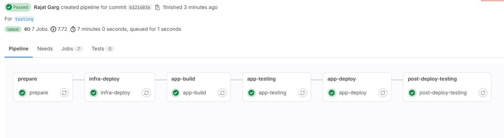
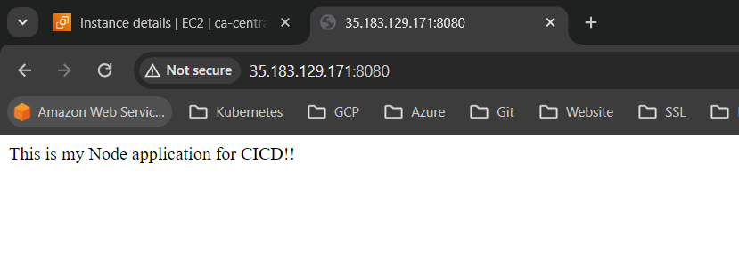
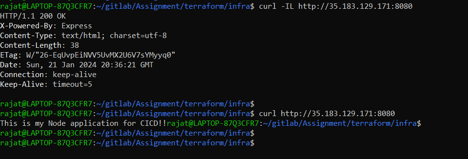

# Assignment

## Name
Simple node application.

## Description

We are creating a simple node js application which will be running on AWS EC2 instance. The build and deployment is through a gitlab CI/CD pipeline that contains multiple stages mentioned below.

- **prepare:** This stage includes pre-setup that creates a S3 bucket and a dynamoDB table which we will be using for terraform state for the infrastructure deployment.
- **infra-deploy:** This includes deployment of the infrastructure for the application. This includes EC2 instance, S3 bucket, RDS instance, required Security groups, IAM roles, Instance profile. (We are not actually using RDS instance and S3 bucket for the application, however it is created as part of the assignment)
- **app-build:** We are performing build of the application in this stage where we are copying the app code from gitlab to Ec2 instance, installing required packages.
- **app-testing:** In testing stage, we are checking whether the required application files exists on the required path. (These are simple tests as per application)
- **app-deploy:** In deployment state, we are running the node application through the app.js file.
- **post-deploy-testing:** Finally, we are performing application testing whether our application is running fine through curl commands.

> We are performing the infrastructure and application deployment in the same pipeline due to sample application. This can be through different pipeline as per the requirement.

> Also, kubernetes deployment and service files are present in kubernetes folder. We can deploy the application on Kubernetes cluster and integrate these files in the pipeline. This is another method to build, test and deploy application on K8s cluster using these configuration files.

> We are using terraform as IAC for infrastructure deployment. Code can be found inside terraform folder. There are 2 sub-folders
> 1. **setup:** IAC code for prepare stage to create S3 bucket and DynamoDB table to serve as terraform state for next stage.
> 2. **Infra:** IAC code for infrastructure deployment
> We can also create the terraform shared code as modules and then just call these modules and pass required variables in terraform.tfvars file inside our application folder.

## Pre-requisites

Below are the pre-requisites,

- Secret variables in gitlab
  - **AWS_ACCESS_KEY_ID:** Access key id for AWS IAM user
  - **AWS_SECRET_ACCESS_KEY:** Secret access key if for IAM user
  - **EC2_PRIVATE_KEY:** Private key which we will use in the EC2 instance
  - **RDS_PASSWORD:** Database password for RDS instance.

- Key pair in AWS account (we will use this private key to add in gitlab secret variables mentioned above)

> We are using Access key and Secret access key for the IAM user which is not recommended. We should be using IAM roles instead, grant necessary permissions on the IAM role and assume this role on the Gitlab runner. But, we are using Gitlab shared runners and not our custom runner, that is why we used IAM user credentials instead of IAM role.

> Also, We can also utilize the Secrets Manager service in AWS and fetch all the credentials from there instead of creating secret variables in Gitlab.

## How to deploy & testing

1. Perform the mentioned pre-requisites.
2. Pass the required variables name in the terraform.tfvars file inside the terraform folder.
3. On commiting, CI/CD pipeline will trigger automatically and will create the infrastructure and deploy the application as well. 

## Deploy screenshots & testing

## Authors and acknowledgment

Rajat Garg

DevOps Engineer

